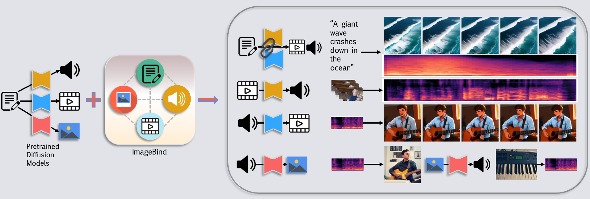

# Seeing-and-Hearing

**This repository includes official codes for "[Seeing and Hearing: Open-domain Visual-Audio Generation with Diffusion Latent Aligners (CVPR 2024)](https://arxiv.org/abs/2402.17723)".** 

## 🔮 Method

**Framework Overview.** Our approach is versatile and can tackle four tasks: joint video-audio generation (Joint-VA), video-to-audio (V2A), audio-to-video (A2V), and image-to-audio (I2A). By leveraging a multimodal binder, e.g., pretrained ImageBind, we establish a connection between isolated generative models that are designed for generating a single modality. This enables us to achieve both bidirectional conditional and joint video/audio generation.

## 🔆 Abstract
Video and audio content creation serves as the core technique for the movie industry and professional users. Recently, existing diffusion-based methods tackle video and audio generation separately, which hinders the technique transfer from academia to industry. In this work, we aim at filling the gap, with a carefully designed optimization-based framework for cross-visual-audio and joint-visual-audio generation. We observe the powerful generation ability of off-the-shelf video or audio generation models. Thus, instead of training the giant models from scratch, we propose to bridge the existing strong models with a shared latent representation space. 
Specifically, we propose a multimodality latent aligner with the pre-trained ImageBind model. Our latent aligner shares a similar core as the classifier guidance that guides the diffusion denoising process during inference time. Through carefully designed optimization strategy and loss functions, we show the superior performance of our method on joint video-audio generation, visual-steered audio generation, and audio-steered visual generation tasks. The project website can be found at [https://yzxing87.github.io/Seeing-and-Hearing/](https://yzxing87.github.io/Seeing-and-Hearing/). 

> **Seeing and Hearing: Open-domain Visual-Audio Generation with Diffusion Latent Aligners** <br>
>  Yazhou Xing<sup>* 1</sup>, Yingqing He<sup>* 1</sup>, Zeyue Tian<sup>* 1</sup>, Xintao Wang<sup>2</sup>, Qifeng Chen<sup>1</sup> (* indicates equal contribution)<br>
>  <sup>1</sup>HKUST, <sup>2</sup>ARC Lab, Tencent PCG <br>

[[Paper](https://arxiv.org/abs/2402.17723)] 
[[Project Page](https://yzxing87.github.io/Seeing-and-Hearing/)]

<!-- <video controls>
  <source src="supp-new-compressed.mp4" type="video/mp4">
  Your browser does not support the video tag.
</video> -->

<!-- 
**Figure:** *Our results* -->

## TODO

- [x] open-source v2a codes 
- [x] open-source evaluation codes 
- [ ] open-source joint-va, a2v, and i2v codes 


## ⚙️ Code 
### Installation 
Please follow the instructions below:
  ```
  git clone https://github.com/yzxing87/Seeing-and-Hearing.git
  cd Seeing-and-Hearing/v2a
  conda create -n seeing python=3.10
  conda activate seeing
  pip install -r pip_env3.txt

  pip install git+https://github.com/yzxing87/transformers

  pip install "git+https://github.com/facebookresearch/pytorchvideo.git"

  pip install transformers_stream_generator
  ```
### V2A generation
1. download necessary checkpoints 

   (1) Download audioldm ckpts from [the huggingface repo](https://huggingface.co/cvssp/audioldm-m-full). Put the ckpts to `ckpt/`. 

    ```
    mkdir ckpt; cd ckpt
    git clone https://huggingface.co/cvssp/audioldm-m-full
    cd ..
    ```

    (2) Download imagebind ckpts `imagebind_huge.pth` from [the official repo](https://github.com/facebookresearch/ImageBind). Put the ckpts to `imagebind/.checkpoints/`. 


    ```
    mkdir imagebind/.checkpoints; cd imagebind/.checkpoints
    wget https://dl.fbaipublicfiles.com/imagebind/imagebind_huge.pth
    cd ../..
    ```

    (3) Download qwen ckpts from [the huggingface repo](https://huggingface.co/Qwen/Qwen-VL-Chat). Put the ckpts to `qwen_ckpt/`.
    ```
    mkdir qwen_ckpt; cd qwen_ckpt
    git clone https://huggingface.co/Qwen/Qwen-VL-Chat
    cd ..
    ```
2. follow `pipeline.sh`

## 🤗 Citation

```
@inproceedings{xing24seeing,
  title     = {Seeing and Hearing: Open-domain Visual-Audio Generation with Diffusion Latent Aligners},
  author    = {Xing, Yazhou and He, Yingqing and Tian, Zeyue and Wang, Xintao and Chen, Qifeng},
  booktitle = {CVPR},
  year      = {2024}
}
```

## 📭 Contact

If you have any comments or questions, feel free to contact [Yazhou Xing](yxingag@connect.ust.hk), [Yingqing He](yhebm@connect.ust.hk) or [Zeyue Tian](ztianad@connect.ust.hk).

## License
Please follow [CC-BY-NC](./LICENSE).